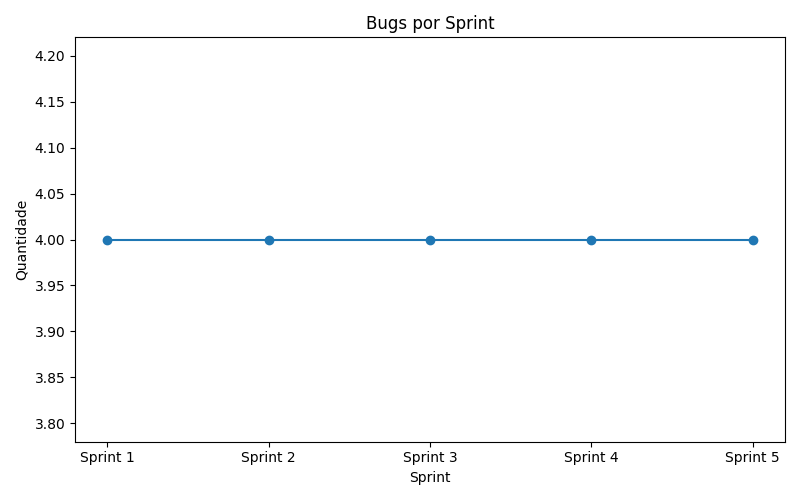
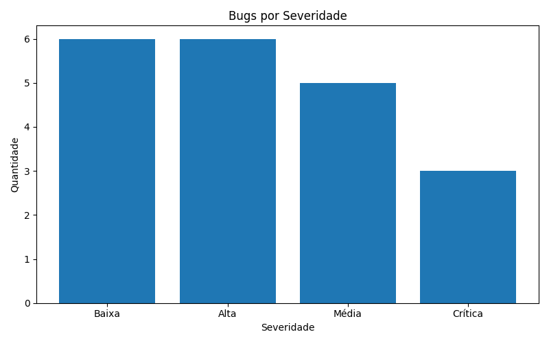
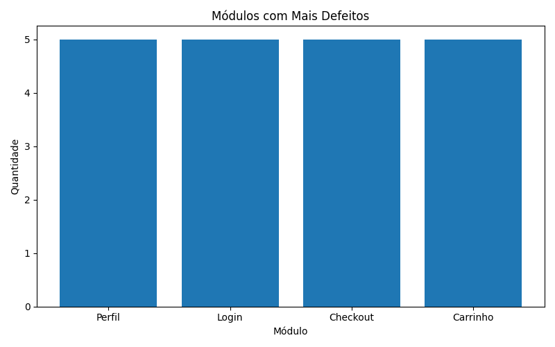

# QA SQL Analytics

## Descrição

Projeto desenvolvido para praticar SQL Analytics aplicado à Qualidade de Software.

Os dados são armazenados em um banco SQLite e analisados através de consultas SQL executadas por Python. O sistema gera relatórios automáticos e gráficos para apoiar a análise de métricas de QA.

---

## Tecnologias Utilizadas

* Python
* SQLite
* SQL
* Matplotlib
* Git
* GitHub

---

## Funcionalidades

* Criação automática de banco SQLite
* Inserção automática de dados
* Consultas SQL para métricas de QA
* Análise de bugs por sprint
* Análise de bugs por severidade
* Identificação dos módulos com mais defeitos
* Cálculo da taxa de resolução
* Geração de relatório TXT
* Geração automática de gráficos PNG

---

## Estrutura do Projeto

qa-sql-analytics/

├── create_database.py

├── analytics.py

├── qa_metrics.db

├── README.md

└── output/

  ├── relatorio_sql.txt

  ├── bugs_por_sprint.png

  ├── bugs_por_severidade.png

  └── modulos_com_mais_bugs.png

---

## Como Executar

Criar o banco:

python create_database.py

Executar as análises:

python analytics.py

---

## Visualizações Geradas

### Bugs por Sprint

### Bugs por Severidade

### Módulos com Mais Defeitos

---

## Objetivo

Este projeto foi desenvolvido para praticar:

* SQL aplicado a QA
* SQLite
* Automação de análises
* Visualização de dados
* Integração entre SQL e Python

---

## Autor

Igor Rodrigo
